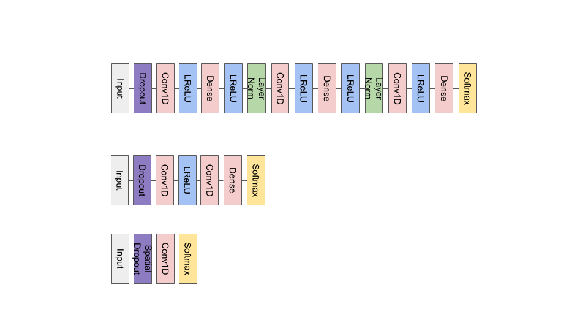

# [Tweet Sentiment Extraction](https://www.kaggle.com/c/tweet-sentiment-extraction/overview)

Main files:
 * `data` - file with data
 * `tweet_sentiment_extraction.ipynb` - notebook for training data
 * `inference.ipynb` - inference notebook

[Trained models](https://drive.google.com/drive/folders/1EfYtwnyqClOHaxjZLYANPzIXVsk3rSgS?usp=sharing)

Solution description:
 * models: three different CNN heads and with every one 5fold-roberta-base
 * max_len=96, no post-processing
 * CrossEntropyLoss, Adam
 * epoch=3, lr=3e-5, scheduler=0.2^epoch, bsz=8
 * Label smoothing with alpha=0.15

Architecture:

 * CNN heads

 
